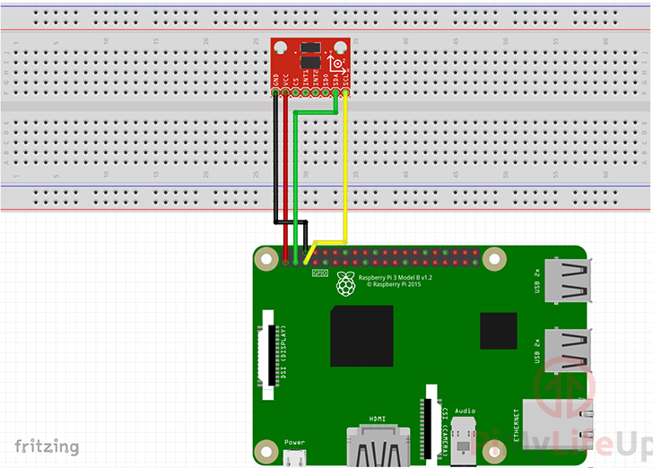

## Serial

Connect the serial to raspberry pi following this diagram:


Run the following command to install the serial tools and start:
```
cd rpi
deploy_and_run.sh --program serial.py  --install 
```

## I2C

Connect i2c to raspberry pi following this diagram:


Wire the GND pin of the Accelerometer to Physical Pin 6 (GND) on the Raspberry Pi.
Wire the VCC pin of the Accelerometer to Physical Pin 1 (3v3) on the Raspberry Pi.
Wire the SDA pin of the Accelerometer to Physical Pin 3 (SDA) on the Raspberry Pi.
Wire the SCL pin of the Accelerometer to Physical Pin 5 (SCL) on the Raspberry Pi.

run the following command to install the i2c tools:
```
cd rpi
deploy_and_run.sh install --program i2c.py --install 
```

make sure to change the ip address in the deploy_and_run.sh file to the ip address of the raspberry pi.

verify that the i2c device is connected by running the following command in your raspberry pi terminal:
```
sudo i2cdetect -y 1
```
output:
```
     0  1  2  3  4  5  6  7  8  9  a  b  c  d  e  f
00:                         -- -- -- -- -- -- -- -- 
10: -- -- -- -- -- -- -- -- -- -- -- -- -- -- -- -- 
20: -- -- -- -- -- -- -- -- -- -- -- -- -- -- -- -- 
30: -- -- -- -- -- -- -- -- -- -- -- -- -- -- -- -- 
40: -- -- -- -- -- -- -- -- -- -- -- -- -- -- -- -- 
50: -- -- -- 53 -- -- -- -- -- -- -- -- -- -- -- -- 
60: -- -- -- -- -- -- -- -- -- -- -- -- -- -- -- -- 
70: -- -- -- -- -- -- -- --   
```

